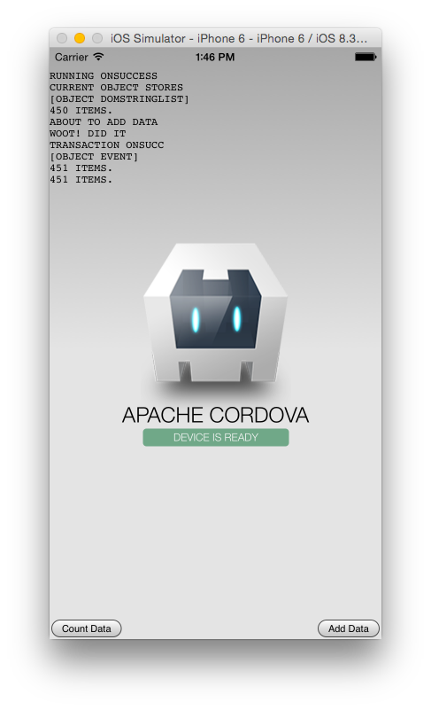

Database Filler
=========

Cordova app to fill up IndexedDB, based on Raymond Camden's blog: http://www.raymondcamden.com/2015/04/17/indexeddb-and-limits

Designed to figure out how much IndexedDB data iOS 8 will let you store in an app.

Note: you need to use the experimental WKWebView instead of UIWebView because UIWebView
doesn't support IndexedDB.

What it does
---

Each time you hit "Add Data", it will insert a ~500KB image of Link from the Legend of Zelda into the database, in base64 string format. So it's not exactly 500KB (in fact, it's probably quite a bit more due to the base64 overhead), but Apple's IndexedDB doesn't support Blobs, so it's what we have to do.



Steps
---

```
cordova platform add ios@4.0.x --usegit
cordova plugin add https://github.com/apache/cordova-plugins.git#master:wkwebview-engine
```

Details here: https://github.com/apache/cordova-plugins/tree/master/wkwebview-engine
